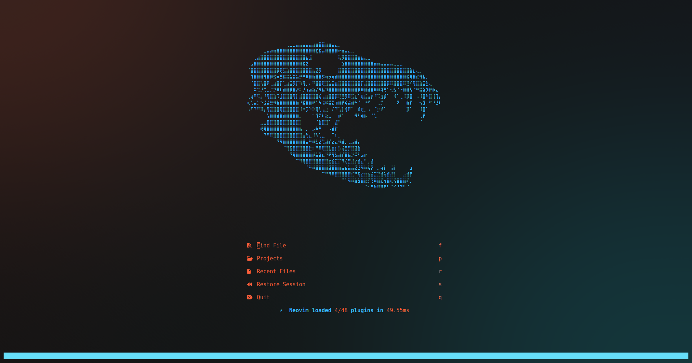

<!-- markdownlint-disable MD033 MD041 -->

<div align="center">


<h1 align="center">The Best Neovim Config</h1>


<p align="center">

[](https://www.lua.org/)

</p>


</div>

<!-- # 💤 My Neovim Config  -->

<p align="center">
  
</p>

<br />

Welcome to my Neovim configuration. It's built on [LazyVim](https://github.com/LazyVim/LazyVim).

This repo exists for two reasons:

1. **Future me**, who just got a new machine and forgot everything. You're welcome.
2. **You**. Admire it, take your time.

<br />

## ✨ Features

### Looks

- **[neofusion](https://github.com/diegoulloao/neofusion.nvim)** colorscheme with **transparent background**.
- **Custom ASCII art dashboard** via `snacks.nvim`. It's huge, padded by 8 lines. It serves no functional purpose. It is the most important file in this repo.
- **Rounded borders everywhere** (windows, completion menu, docs popups, floating terminal).
- **Lualine** wearing neofusion's own theme with flat separators.
- **Bufferline** with **thicc** separators.
- **Smear cursor** and **mini.animate**.
- **Treesitter context**.

### Languages (the Ones I Actually Use)

| Language | What's going on |
| --- | --- |
| **Go** | `gopls` with gofumpt **disabled** (I have opinions), `goimports` for formatting, `golangci-lint` for being told I'm wrong. |
| **TypeScript / JS** | LazyVim extra + ESLint + Prettier. |
| **SQL** | `sqlfluff` forced into the **Postgres** dialect. |
| **Markdown** | Prettier is **banned** here. `markdownlint-cli2` + `markdown-toc` only. |
| **JSON** | LazyVim extra. |
| **Make** | Treesitter parser for Makefiles. |
| **Lua / YAML / JSON / Dart** | Forced to 2-space indent via autocmd. Everything else gets 4 spaces. Tabs get nothing. |

### Other Stuff

- **DAP** and **test runner** extras, for rare occasions.
- **[nvim-surround](https://github.com/kylechui/nvim-surround)**.
- **LSP inlay hints disabled** by default. I know what type my variable is.
- **Vertical picker layout** and a **floating terminal**.

<br />

## ⌨️ Keymaps I Added

All one of them:

| Key | Action |
| --- | --- |
| `<leader>h` | Go back to the dashboard. To stare at the ASCII art. Again. |

Everything else is [LazyVim's defaults](https://www.lazyvim.org/keymaps).

<br />

## 🚀 Installation

Here's what you need.

### Prerequisites

- **Neovim >= 0.11** (the config uses `winborder`, which older versions will politely crash on)
- **git**
- **A [JetBrains Mono Nerd Font](https://www.nerdfonts.com/font-downloads.)** or any other nerd font, otherwise the dashboard icons will be little boxes of shame.
- **A C compiler** (for Treesitter parsers)
- **[ripgrep](https://github.com/BurntSushi/ripgrep)** and **[fd](https://github.com/sharkdp/fd)** for the picker
- **[lazygit](https://github.com/jesseduffield/lazygit)** (optional, but you'll want it)
- **Go, Node.js**, and friends for the language tooling. Mason will install the LSPs/formatters, but it can't install the languages themselves.

### Steps

```bash
# 1. Back up whatever sad config your machine has
mv ~/.config/nvim ~/.config/nvim.bak
mv ~/.local/share/nvim ~/.local/share/nvim.bak
mv ~/.local/state/nvim ~/.local/state/nvim.bak
mv ~/.cache/nvim ~/.cache/nvim.bak

# 2. Clone this masterpiece
git clone https://github.com/ditramadia/nvim.git ~/.config/nvim

# 3. Launch it and watch lazy.nvim install everything
nvim
```

Plugin versions are pinned in `lazy-lock.json`, so you get **exactly** the setup that worked last time
instead of whatever broke upstream this week. Run `:Lazy restore` if things look off.

Then run `:checkhealth` and fix whatever it yells about.

<br />

## 📁 Structure

```text
~/.config/nvim
├── init.lua                 # One line. Truly a feat of engineering.
├── lazy-lock.json           # Pinned plugin versions. Do not touch.
├── lazyvim.json             # Enabled LazyVim extras
└── lua
    ├── config
    │   ├── autocmds.lua     # 2-space indent for lua/yaml/json/dart
    │   ├── keymaps.lua      # The one (1) keymap
    │   ├── lazy.lua         # lazy.nvim bootstrap
    │   └── options.lua      # 4-space indent, rounded borders
    └── plugins
        ├── colorscheme.lua  # neofusion, transparent
        ├── dashboard.lua    # The ASCII art. The crown jewel.
        ├── editor.lua       # nvim-surround
        ├── lang-*.lua       # Per-language tweaks (go, make, markdown, sql)
        ├── lsp.lua          # Inlay hints: off
        └── ui.lua           # Lualine, bufferline, blink.cmp, snacks tweaks
```

<br />

## 🙏 Credits

- [folke](https://github.com/folke), for LazyVim, lazy.nvim, snacks.nvim, and basically my entire personality as a Neovim user.
- [diegoulloao](https://github.com/diegoulloao), for neofusion.
- Me.

## 📜 License

Apache 2.0, inherited from the LazyVim starter. Steal whatever you want, that's what I did.
